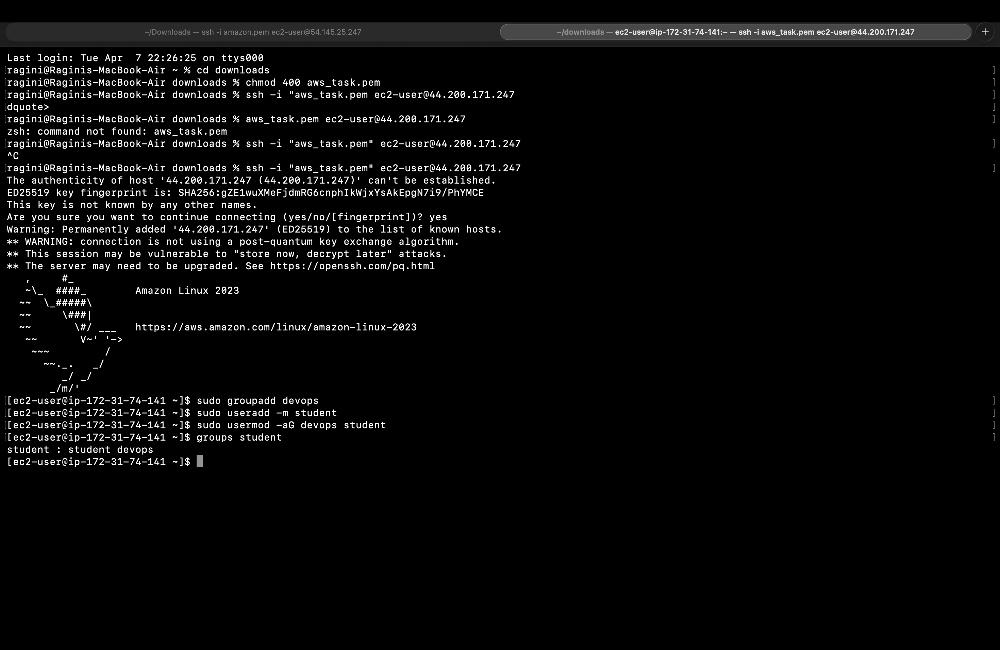
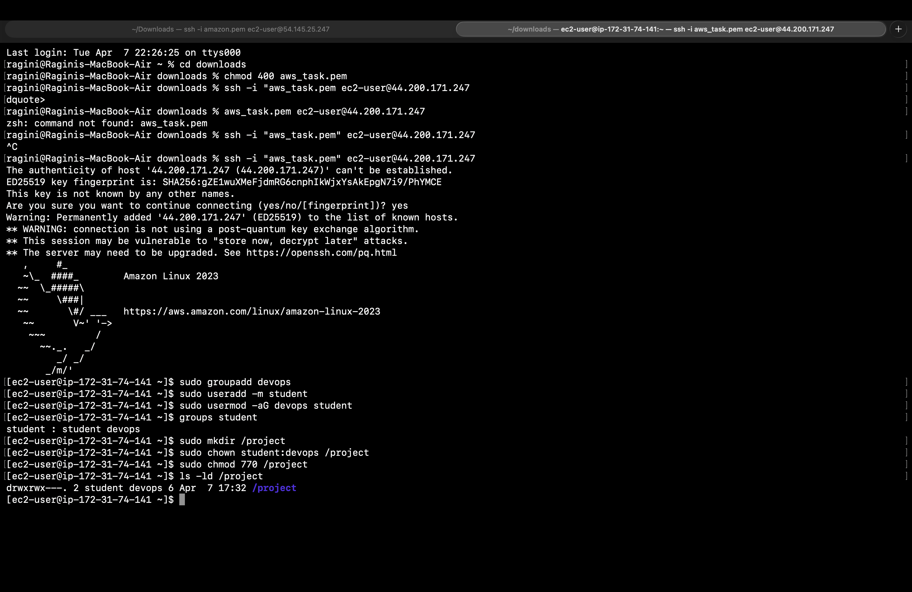
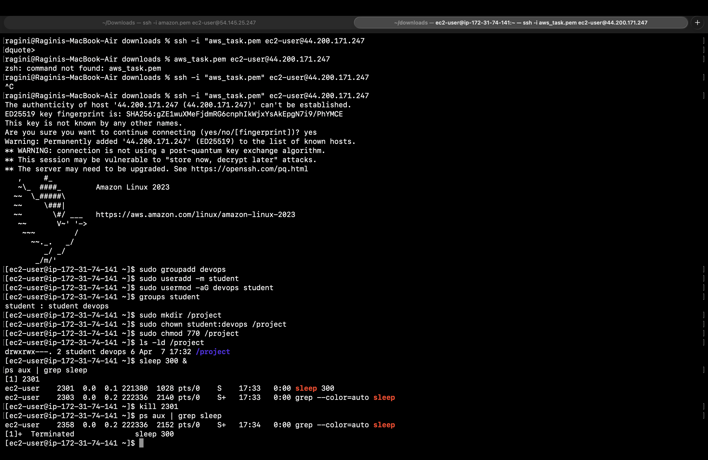
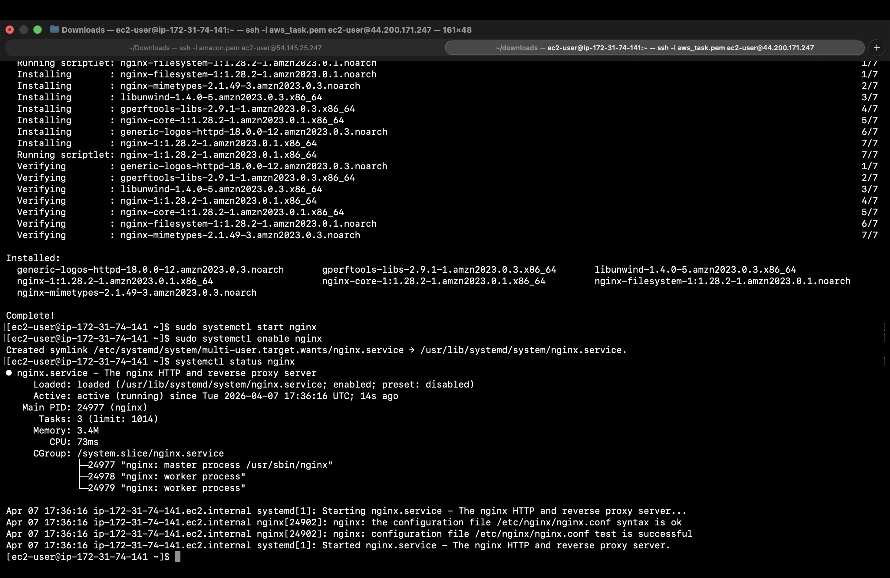
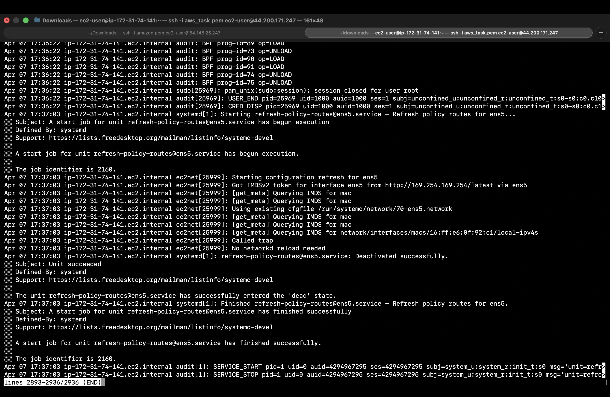
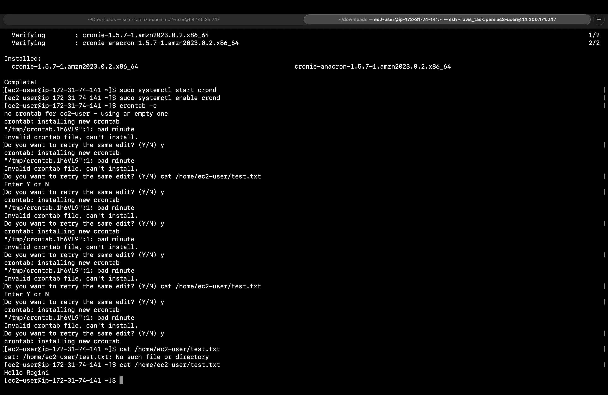

# 🚀 AWS Linux Mini Lab

This project demonstrates basic Linux system administration tasks performed on an AWS EC2 instance.

---

## 📌 Tasks Covered

### 1. EC2 Setup
- Created EC2 instance (Amazon Linux)
- Connected using SSH (.pem key)

### 2. User & Group Management
- Created group: `devops`
- Created user: `student`
- Added user to group

📸 Screenshot:

---

### 3. File Permissions
- Created `/project` directory
- Changed ownership and permissions

📸 Screenshot:

---

### 4. Process Management
- Ran background process using `sleep`
- Checked using `ps` and `grep`

📸 Screenshot:

---

### 5. Nginx Setup
- Installed nginx
- Started and enabled service

📸 Screenshot:

---

### 6. Logs Monitoring
- Checked system logs

📸 Screenshot:

---

### 7. Cron Job
- Installed cronie
- Created cron job to write into file

📸 Screenshot:

---

## 🎁 Bonus Task

### ✔ Created new user
sudo useradd testuser

### ✔ Restricted SSH access
- Edited SSH config:

AllowUsers student

### ✔ Cron cleanup job

rm -f /home/ec2-user/test.txt

---

## 🛠️ Tools Used
- AWS EC2
- Linux (Amazon Linux 2023)
- SSH
- VS Code

---

## 👩‍💻 Author
Ragini Singh